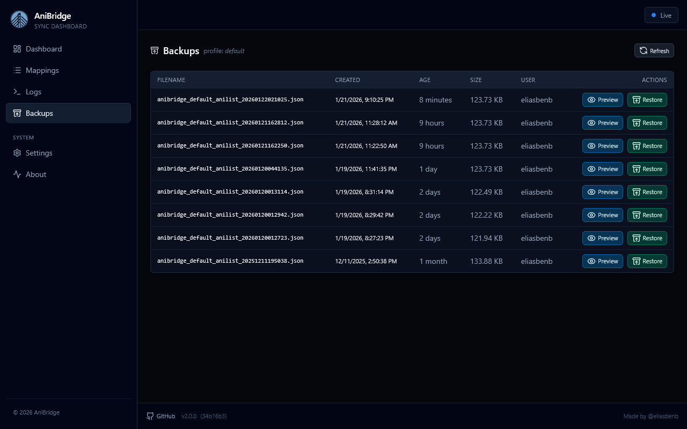

# Backups

Use the backups page to browse, preview, and restore the list snapshots AniBridge creates for you. The page has two stops: a profile picker at `/backups` and a detailed table at `/backups/{profile}`. Everything you see reflects the real files stored in `AB_DATA_PATH/backups`, so you always know what is available.

!!! note "Backup Retention"

    Backups are kept for 30 days by default. Adjust [`backup_retention_days`](../configuration.md#backup_retention_days) if you need a longer retention window.

The profile view lists every backup with its filename, when it was created, how old it is, file size, and which user it belongs to.

Actions on each row:

- `Preview` opens the backup in a modal so you can skim the JSON of your list backup before doing anything permanent.
- `Restore` triggers the restore job.
