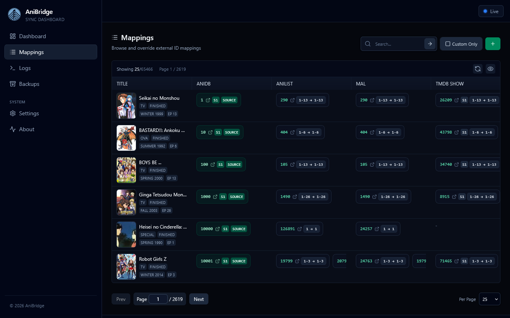

# Mappings

The mappings page lets you browse and manage the mapping database. You can search existing records with a powerful query language and manage mapping overrides.

## Searching & Filtering

- The search bar uses the [Mappings Query Language](../mappings/mappings-querying-language.md) with autocomplete hints as you type.
- Press `Enter` or click the search icon to run a query.
- Toggle `Custom Only` to limit results to entries sourced from your [custom mappings](../mappings/custom-mappings.md).

## Table Controls

- Column visibility can be set by clicking the eye icon popover; toggles persist in local storage.
- Drag column separators to resize widths as needed; column widths persist in local storage.
- Use `Show All`, `Hide All`, or `(reset)` inside the eye icon popover to restore the default column layout.
- Pagination controls (page navigation, per page size) sit at the foot of the table.

## Editing & Creating Overrides

- `New Override` (plus icon in toolbar) opens the editor with a blank template; `Edit` in a row pre-fills fields from the current mapping.
- Press "Reveret to Upstream" on any mapping to delete the override and restore the original as it exists in the upstream sources (note this requires refetching the upstream data).
