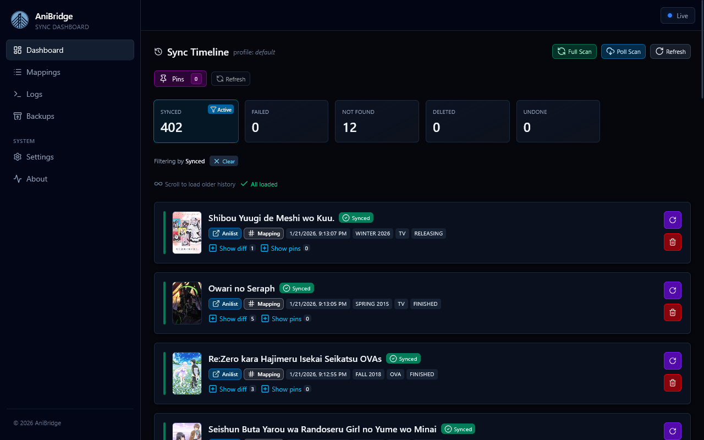

# Timeline

The sync timeline gives you a live feed of sync activity for a specific profile. It combines current sync progress, websocket updates, and stored history so you can see exactly what changed, when, and why.

## Header Controls

- `Full Scan` runs a complete rescan of the selected profile.
- `Poll Scan` asks the backend to poll for new or recently changed items without resetting library state.
- When a sync is running the header shows stage, library section, processed counts, and a progress meter.

## Outcome Filters & Stats

- The filter cards summarise counts for `Synced`, `Failed`, `Not Found`, `Deleted`, and `Undone` outcomes.
- Click a card to filter by that outcome; click the `Clear` badge to remove the filter.
- Counts update as history entries stream in, so you can watch failures or retries in real time.

## History Feed

- New entries arrive via the `/ws/history/{profile}` websocket and appear at the top of the feed.
- Infinite scrolling loads older history as you reach the sentinel at the bottom.
- Each card displays external and internal links (when available), library metadata, timestamp, and any backend error message.

## Entry Actions

- `Retry` re-queues a failed or not found item.
- `Undo` reverses successful syncs by returning the entry to its prior state.
- `Delete` removes the history entry from the database (purely cosmetic; does not affect the list provider).

## Diff Viewer

- The diff viewer highlights changes between the `before` and `after` states.
- The default `Changes` tab shows only modified fields with color-coded additions and deletions.
- Use the search box to filter by JSON path, show unchanged values, or switch to the side-by-side `Compare` tab for a holistic view.

## Pinning Controls

- Use `Show pins` on an entry to pick fields that must stay untouched for that title.
- The global `Pins` button opens the pins manager, letting you search titles, review every pinned record, and edit multiple entries without leaving the timeline.
